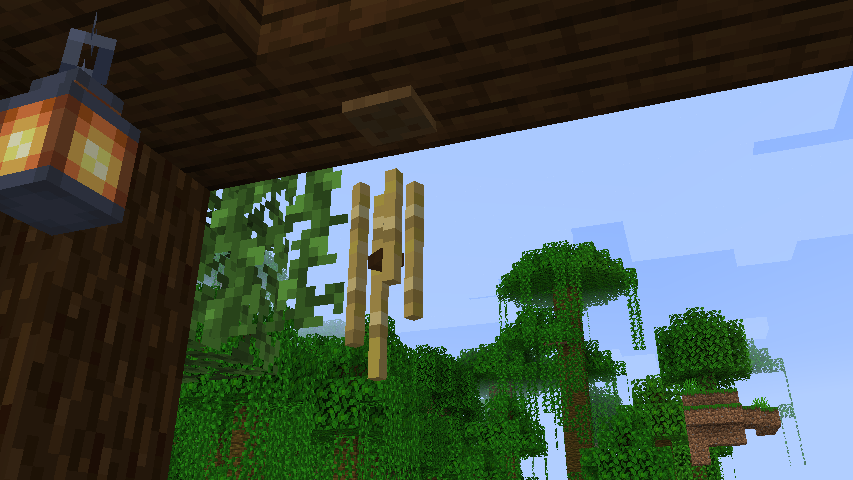
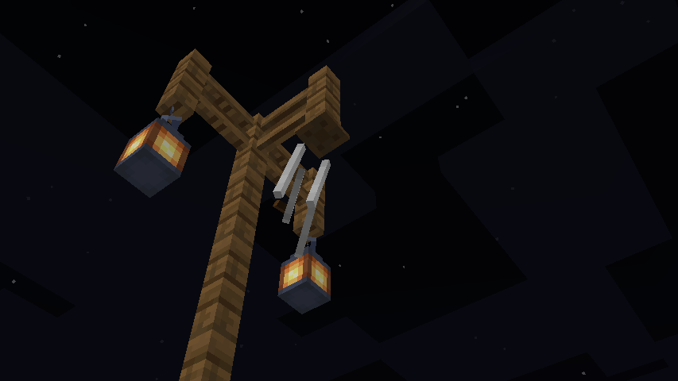
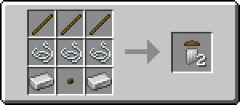
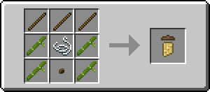
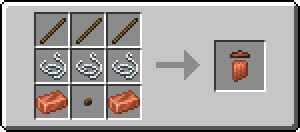

# Windchimes

This is a lightweight mod that adds wind chimes to the game!

They sway in the wind, and aren't just static blocks, they *are* chimes and they do chime - and even more if it's raining.

So far, there's only iron pipe chimes, copper pipe chimes, and bamboo chimes.
More are to come, maybe also perhaps a dreamcatcher?
Here are the crafting recipses:

This mod is available under the Unlicense license.
Feel free to learn from it and incorporate it in your own projects.

---

Made by Hibi\
Discord: https://discord.gg/Zef3c27dN2
